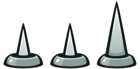
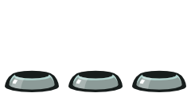
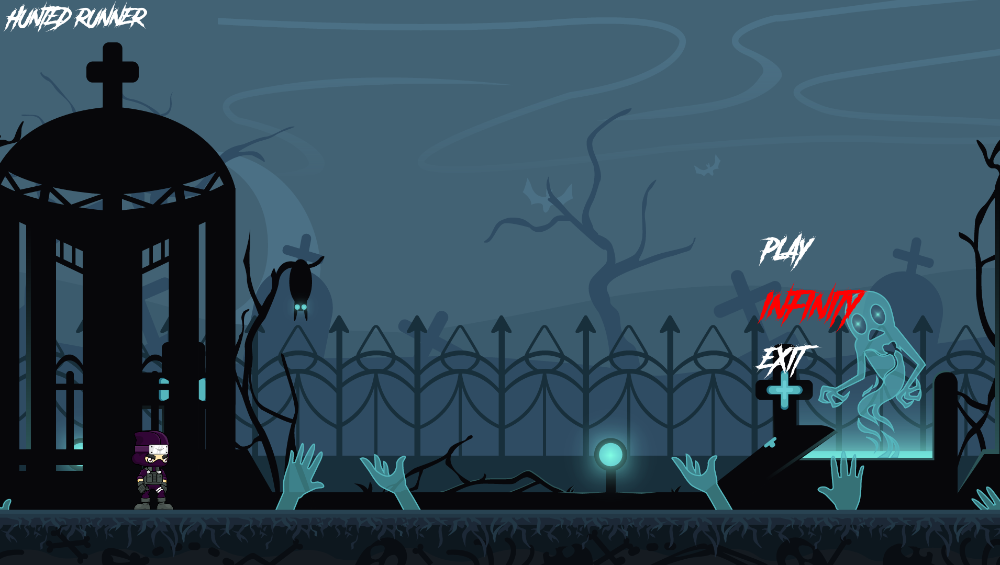
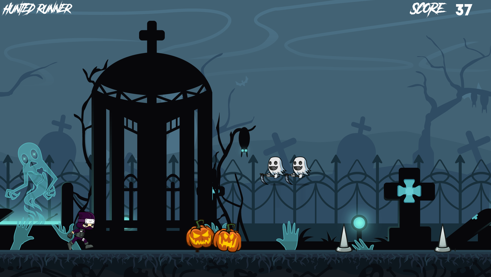

# My Runner 🏃‍♂️

Welcome to **My Runner**.

This project is inspired by the fast-paced dynamics of Geometry Dash.

This project is designed to challenge and enhance your skills in creating a finite Endless Running Game.

## Language and Tools 🛠️

- **Language:** C
- **Framework:** SFML (Simple and Fast Multimedia Library)
- **Compilation:** Via Makefile, including `re`, `clean`, and `fclean` rules.
- **Binary Name:** my_runner

## Project Overview 🔎

**My Runner** is not just a technical exercise but a venture into real game development. It requires managing user inputs, displaying animated sprites, and dealing with game physics.

The game involves a character running through a map filled with obstacles and enemies, where the player must jump to avoid these hurdles.

The aim is to make this game a blend of engaging gameplay and technical prowess.

## Game Features 🎮

- **Basic Mechanics:** Running character, jumping to avoid obstacles and enemies.
- **Scoring System:** Score increases as the player progresses, displayed during the game.
- **Game Physics:** Handling jumping, falling, and collisions.
- **End Conditions:** Game concludes on victory or defeat.
- **Visual Elements:** Animated sprites, parallax scrolling background.
- **Map Handling:** Accepts a map file as an argument for gameplay.

### Advanced Features

- Random enemy spawning, consistent animation and movement regardless of computer speed.
- Window size customization, framerate limitation to prevent lag.
- `-h` option for displaying usage instructions.

### Extended Features

- Multiple levels, main and pause menus.
- Infinite mode with random map generation.

## Gameplay 🕹️

Players navigate a running character through a challenging map, avoiding obstacles by jumping. The game's difficulty escalates as you progress, testing both your reflexes and strategy.

Maps are customizable, with a detailed format described in `.legend` at the repository's root:

## Preview 📸

*Above is a preview of My Runner gameplay, showcasing the dynamic and challenging environment players will experience.*

## Installation and Usage 💾

1. Clone the repository.
2. Compile using Makefile: `make`.
3. Run the game: `./my_runner map_file`.
4. For detailed guidelines, refer to `my_runner.pdf`.

## License ⚖️

This project is released under the MIT License. See `LICENSE` for more details.
